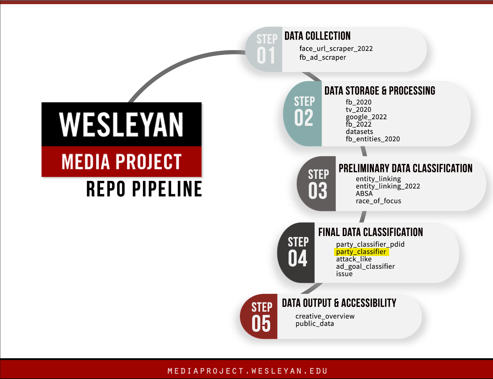

# Wesleyan Media Project -Ad-level Party Classifier

Welcome! This repo is a part of the Cross-platform Election Advertising Transparency initiative ([CREATIVE](https://www.creativewmp.com/)) project. CREATIVE is a joint infrastructure project of WMP and privacy-tech-lab at Wesleyan University. CREATIVE provides cross-platform integration and standardization of political ads collected from Google and Facebook. You will also need the repo [datasets](https://github.com/Wesleyan-Media-Project/datasets) and [fb_2020](https://github.com/Wesleyan-Media-Project/fb_2020) repos to run the script.

This repo is a part of the Final Data Classification step.


## Table of Contents

- [Introduction](#introduction)
- [Objective](#objective)
- [Data](#data)
- [Setup](#setup)
  - [Requirements](#requirements)
  - [Training](#training)
  - [Model](#model)
  - [Performance](#performance)

## Introduction

This repo is a multinomial party classifier that classifies ads into DEM/REP/OTHER. The difference to the [other](https://github.com/Wesleyan-Media-Project/party_classifier_pdid) party classifier is that in this one, the training data consists of **individual** ads whose pd_id has `party_all` coded in the WMP entity file. By contrast, the other party classifier concatenates all ads of a pd_id into one. In practice, when discrete party predictions are needed, the other party classifier should be preferred, because it assumes that all ads belonging to a pd_id will be the same party. The main purpose of this classifier is to get predicted probabilities for individual ads, which can then be used to express the degree to which an ad belongs to either party.

## Objective

Each of our repos belongs to one or more of the following categories:

- Data Collection
- Data Storage & Processing
- Preliminary Data Classification
- Final Data Classification

This repo is part of the Final Data Classification section.

## Data

The data created by the scripts in this repo is in csv.gz format and located in `/data` folder. The classifier outputs class labels (DEM/REP/OTHER), as well as class labels aggregated to the pd_id-level (advertiser_id for Google) via majority vote (OTHER in case of a tie), as well as class probabilities. However, for the latter, the other party classifier repo should preferably be used.

## Setup

The scripts are numbered in the order in which they should be run. Scripts that directly depend on one another are ordered sequentially. Scripts with the same number are alternatives, usually they are the same scripts on different data, or with minor variations. The outputs of each script are saved, so it is possible to, for example, only run the inference script, since the model files are already present.

There are separate folders for Facebook and Google. Within Facebook, the code needs to be run in the order of knowledge base, training, and then inference.

For an example pipeline, training on 2020 Facebook, and then doing inference on 2020 Facebook, see `pipeline.sh`. This should take about 20 minutes to run on a laptop.

Some scripts require datasets from the [datasets](https://github.com/Wesleyan-Media-Project/datasets) repo (which contains datasets that aren't created in any of the repos and intended to be used in more than one repo) and the [fb_2020](https://github.com/Wesleyan-Media-Project/fb_2020) repo (containing 2020 ad text and metadata). Those repos are assumed to be cloned into the same top-level folder as the party_classifier repo.

### Requirements

The scripts use both R (4.2.2) and Python (3.9.16). The packages we used are described in requirements_r.txt and requirements_py.txt.

### Training

Training is done on the portion of the 1.4m dataset for which party_all is known, based on merging with the most recent WMP entities file (v090622). Only pages for which all of their pd_ids are associated with the same party_all are used. For training, the data is split by assigning 70% of the page_ids to training, and 30% of the page_ids to test. Ergo, all ads associated with a specific page_id can only be in either training or test.

The reason we split on page_id and not pd_id is because because different pd ids of the same page are always going to be similar. If we use pd id we could end up with some pd ids of the same page id ending up in the training set, and some in the test set, which would be unfair.

The following fields are used in the classifier by concatenating them in the following order, separated by a single space: disclaimer, page_name, ad_creative_body, ad_creative_link_caption, ad_creative_link_description, ad_creative_link_title, ocr, asr. Prior to the train/test split, the concatenated ads are de-duplicated, so that only one version of every concatenated ad content can go into either train/test (we could potentially only de-duplicate within page_ids, but currently don't).

### Model

The model is a random forest classifier, with CalibratedClassifierCV wrapped around it for smoother class probabilities (i.e. so that not all probabilities are either >0.99 or <0.01).

Previously, we used logistic regression, with C=10 and solver='newton-cg', but random forest has proven to be a better classifier.

For more information about the models, you can look at the notes in the `/notes` folder.

### Performance

Performance on held-out test set:

```

               precision    recall  f1-score   support
 
          DEM       0.86      0.91      0.89     15366
        OTHER       0.84      0.05      0.10       698
          REP       0.82      0.81      0.82      9270
 
     accuracy                           0.85     25334
    macro avg       0.84      0.59      0.60     25334
 weighted avg       0.85      0.85      0.84     25334
```
